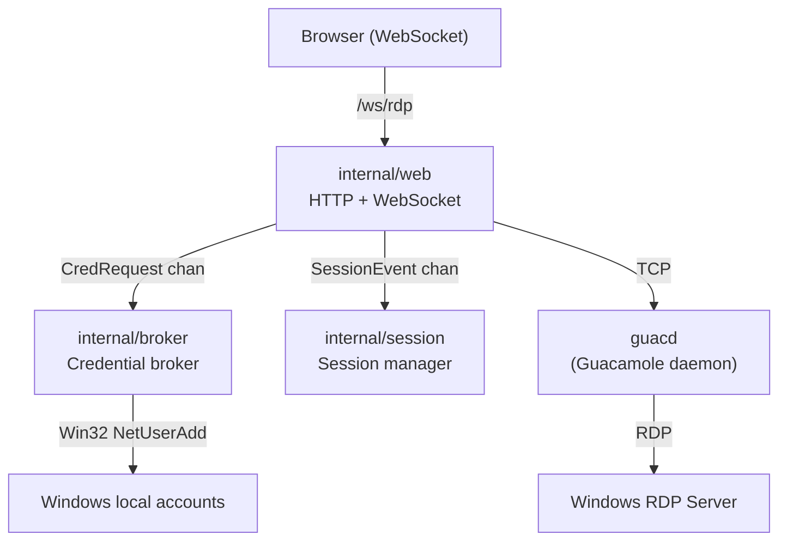
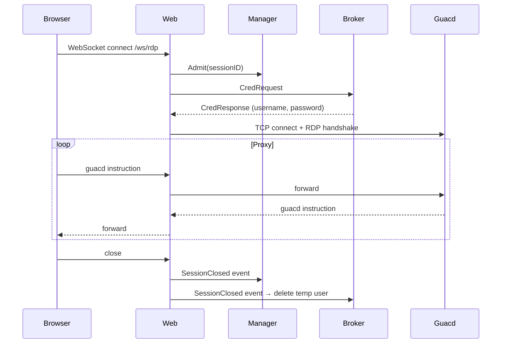

# Architecture

## Components

- `cmd/rdpserver`: process bootstrap, shutdown, and Windows service mode selection
- `internal/web`: HTTP server, index handler, WebSocket upgrade and session spawn
- `internal/session`: session admission manager and per-session proxy workers
- `internal/broker`: temporary Windows account lifecycle and credential broker loop
- `internal/guacd`: Guacamole protocol instruction codec and TCP client
- `ui`: embedded static HTML client

## Runtime flow

1. Client connects to `/ws/rdp`.
2. Session manager enforces `MAX_SESSIONS`.
3. Broker provisions a temporary local user and returns credentials.
4. Session worker connects to `guacd` and sends the RDP handshake.
5. WebSocket and `guacd` traffic are proxied bidirectionally.
6. On close/error/shutdown, temporary account is deleted and capacity is released.

## Shutdown behavior

- Console mode: OS signals cancel context.
- Service mode: SCM stop/shutdown events cancel context.
- Shared shutdown channel closes worker loops and triggers cleanup.
