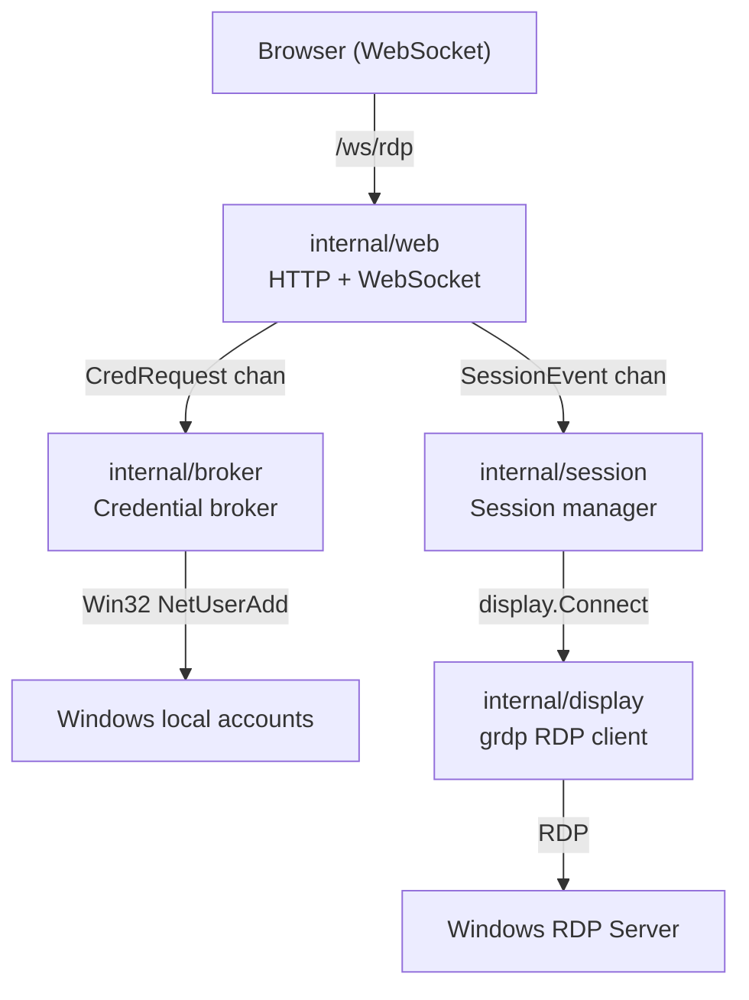
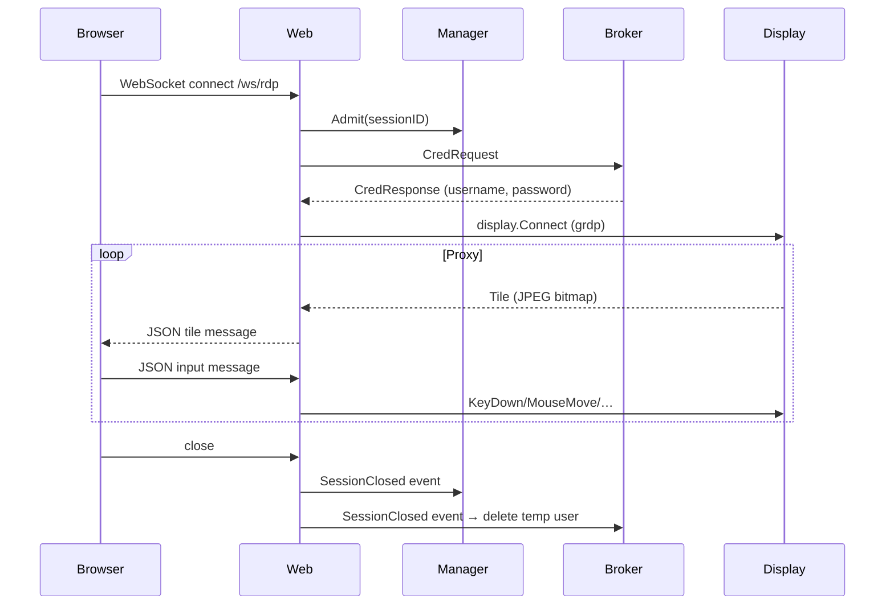

# Architecture

## Components

| Package | Responsibility |
| --- | --- |
| `cmd/rdpserver` | Process bootstrap, shutdown, and Windows service mode selection |
| `internal/web` | HTTP server, index handler, WebSocket upgrade, and session spawn |
| `internal/session` | Session admission manager and per-session proxy workers |
| `internal/broker` | Temporary Windows account lifecycle and credential broker loop |
| `internal/display` | Pure-Go RDP client interface and `grdp`-backed implementation |
| `ui` | Embedded static HTML/JS canvas client |

## Component diagram



## Runtime flow

1. Client connects to `/ws/rdp`.
2. Session manager enforces `MAX_SESSIONS`.
3. Broker provisions a temporary local user and returns credentials.
4. Session worker opens an RDP connection via the pure-Go `grdp` client.
5. Bitmap tile updates are JPEG-encoded and forwarded to the browser as JSON WebSocket messages.
6. Keyboard and mouse input arrives as JSON messages and is forwarded to the RDP session.
7. On close, error, or shutdown the temporary account is deleted and capacity is released.



## Wire protocol

Messages between browser and server are JSON objects sent over WebSocket.

**Server → Browser (tile update)**

```json
{ "type": "tile", "x": 0, "y": 0, "w": 200, "h": 100, "data": "<base64 JPEG>" }
```

**Browser → Server (input events)**

```json
{ "type": "keydown",    "scancode": 28 }
{ "type": "keyup",      "scancode": 28 }
{ "type": "mousemove",  "x": 320, "y": 240 }
{ "type": "mousedown",  "button": 0, "x": 320, "y": 240 }
{ "type": "mouseup",    "button": 0, "x": 320, "y": 240 }
{ "type": "mousewheel", "delta": 3 }
```

## Shutdown behaviour

| Mode | Signal source |
| --- | --- |
| Console | OS signals (`SIGINT`, `SIGTERM`) cancel context |
| Windows Service | SCM stop/shutdown events cancel context |

A shared shutdown channel closes all worker loops and triggers temporary account cleanup before the process exits.
