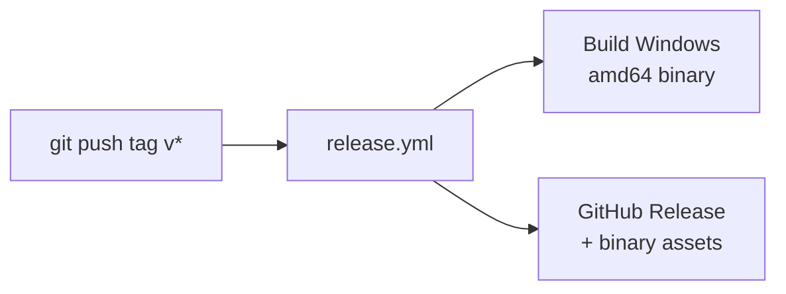
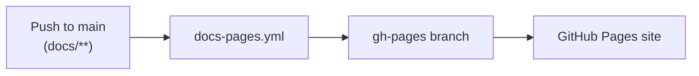

# Development and release

## Build

=== "Linux / macOS"

    ```bash
    # Run unit tests
    go test ./...

    # Cross-compile for Windows (required — service code is Windows-only)
    GOOS=windows GOARCH=amd64 go build ./...
    ```

=== "Windows"

    ```powershell
    # Run unit tests
    go test ./...

    # Build native binary
    go build -o rdpserver.exe ./cmd/rdpserver
    ```

## CI workflows

| Workflow | Trigger | Purpose |
| --- | --- | --- |
| `build.yml` | Pull request | `go test` + Windows-targeted build validation |
| `release.yml` | Push tag `v*` | Multi-platform binary release assets |
| `docs-pages.yml` | Push to `main` (docs/**) | Publish `/docs` to `gh-pages` |

## Release flow

1. Create a version tag (for example `v1.0.0`).
2. Push the tag.
3. Release workflow builds archives and publishes GitHub Release assets.



## Documentation publishing flow

1. Merge docs changes to `main`.
2. Docs workflow deploys `/docs` content to `gh-pages`.
3. In repository settings, configure GitHub Pages source to `gh-pages` / root.



!!! tip "Local docs preview"
    Install the doc dependencies and run a local preview server:

    ```bash
    pip install -r requirements.txt
    zensical build
    ```
