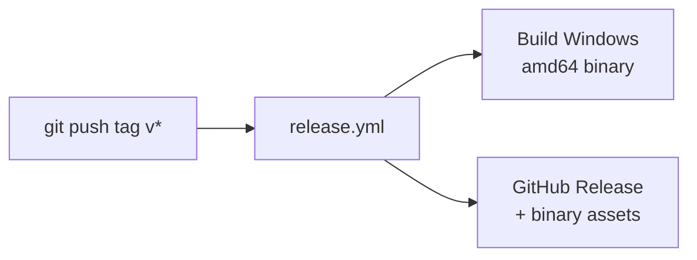
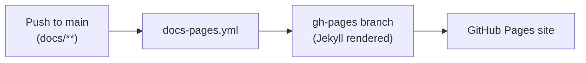

# Development and release

## Validate locally

```bash
go test ./...
GOOS=windows GOARCH=amd64 go build ./...
```

## CI workflows

- `build.yml`: pull request checks (`go test`, Windows-targeted build)
- `release.yml`: tagged (`v*`) multi-platform binary release assets
- `docs-pages.yml`: publishes `/docs` to `gh-pages` branch

## Release flow

1. Create a version tag (for example `v1.0.0`).
2. Push the tag.
3. Release workflow builds archives and publishes GitHub Release assets.



## Documentation publishing flow

1. Merge docs changes to `main`.
2. Docs workflow deploys `/docs` content to `gh-pages`.
3. In repository settings, configure GitHub Pages source to `gh-pages` / root.


