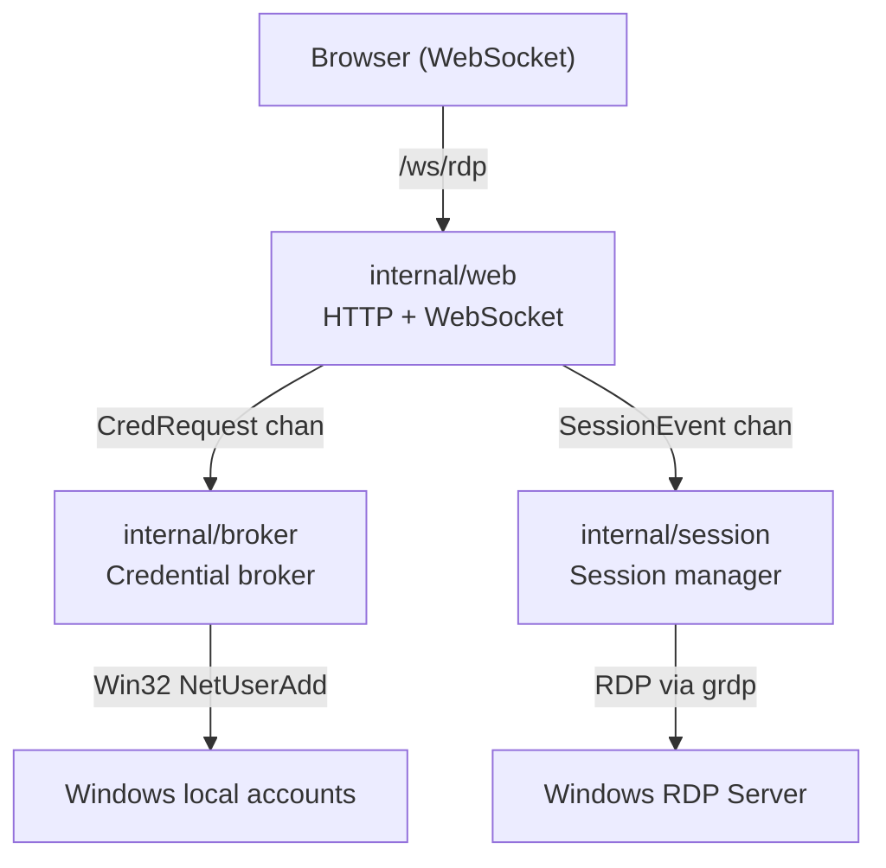

# go-rdp-server

[](https://github.com/pacorreia/go-rdp-server/actions/workflows/build.yml)
[](https://github.com/pacorreia/go-rdp-server/releases)
[](https://go.dev/)

A lightweight, browser-based RDP gateway that brokers temporary Windows credentials and connects directly to RDP using a pure-Go client — no external dependencies required.

## Features

🌐 **Browser-Based RDP**

- Zero client installation — pure WebSocket from the browser
- Pure-Go RDP client (`github.com/nakagami/grdp`) — no `guacd` or Guacamole daemon needed
- Canvas-based HTML/JS client served directly from the binary
- JSON WebSocket wire protocol with base64-encoded JPEG tile updates

🔐 **Temporary Credential Brokering**

- Provisions short-lived local Windows accounts per session
- Credentials are automatically removed on session close or error
- Isolates each session with a unique account identity

🔄 **Session Management**

- Configurable maximum concurrent sessions (`MAX_SESSIONS`)
- Admission control rejects connections when capacity is reached
- Graceful cleanup on disconnect, error, or shutdown

🪟 **Windows Service Ready**

- Runs as a native Windows Service via `golang.org/x/sys/windows/svc`
- SCM start/stop/shutdown signal handling
- Automatic recovery configuration support

## Quick Links

- **[Architecture](architecture.md)** — Runtime flow, component diagram, and shutdown behaviour
- **[Configuration](configuration.md)** — All environment variables and recommended defaults
- **[Windows Service](windows-service.md)** — Install, operate, and harden the service
- **[Development](development.md)** — Build, test, and release workflows

## Architecture Overview



## Getting Started

### Prerequisites

- A Windows host with RDP enabled
- Go 1.24+ (for building from source)

### Installation

=== "Binary (Windows)"

    Download the pre-built binary from the [releases page](https://github.com/pacorreia/go-rdp-server/releases):

    ```powershell
    # Set configuration via environment variables
    $env:RDP_HOST   = "127.0.0.1"
    $env:RDP_PORT   = "3389"
    $env:HTTP_PORT  = "8080"
    $env:MAX_SESSIONS = "10"

    # Run the server
    .\rdpserver.exe
    ```

=== "Build from Source"

    ```bash
    git clone https://github.com/pacorreia/go-rdp-server
    cd go-rdp-server

    # Cross-compile for Windows
    GOOS=windows GOARCH=amd64 go build -o rdpserver.exe ./cmd/rdpserver
    ```

=== "Windows Service"

    ```powershell
    # Build and register as a Windows Service using the built-in flag
    go build -o rdpserver.exe ./cmd/rdpserver
    .\rdpserver.exe -install-service
    sc.exe start go-rdp-server
    ```

    See [Windows Service operations](windows-service.md) for full details.

### First Use

After starting the server, open `http://<host>:8080` in your browser. The embedded client will connect automatically over WebSocket to `/ws/rdp`.

```bash
# Verify the server is running
curl http://localhost:8080/
```
